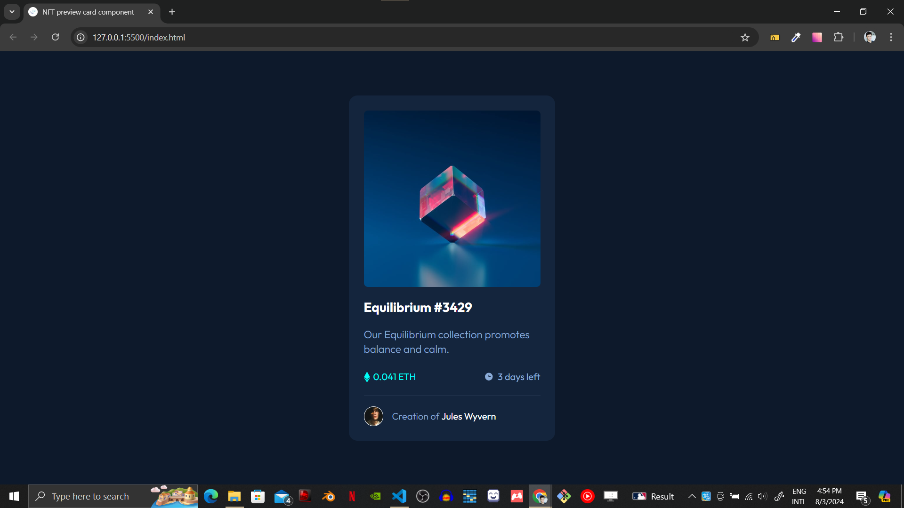

# Frontend Mentor - NFT preview card component solution

This is a solution to the [NFT preview card component challenge on Frontend Mentor](https://www.frontendmentor.io/challenges/nft-preview-card-component-SbdUL_w0U). Frontend Mentor challenges help you improve your coding skills by building realistic projects. 

## Table of contents

- [Overview](#overview)
  - [The challenge](#the-challenge)
  - [Screenshot](#screenshot)
  - [Links](#links)
- [My process](#my-process)
  - [Built with](#built-with)
  - [What I learned](#what-i-learned)
  - [Continued development](#continued-development)
  - [Useful resources](#useful-resources)
- [Author](#author)

## Overview

### The challenge

Users should be able to:

- View the optimal layout depending on their device's screen size
- See hover states for interactive elements

### Screenshot




### Links

- Solution URL: [Add solution URL here](https://your-solution-url.com)
- Live Site URL: [Add live site URL here](https://your-live-site-url.com)

## My process

### Built with

- Semantic HTML5 markup
- CSS custom properties
- Flexbox

### What I learned

Got a better understanding on how align-items work, at first I was struggling to make it align to the center without realing that it required enough height to move.
Another thing was hiding an image and make it visible once the element is hovered by the cursor. I would say that this was something completely new, and I would not have figured by myself.

So, just to keep a record of it:

```css
main {
    display: flex;
    align-items: center;
    justify-content: center;
    height: 100vh;
    padding: 0 25px;
}
```

So to make it also center verticaly, it was used the height: 100vh;

```css
.nft-card .image-link::before{
    content: '';
    background-color: white;
    width: 100%;
    height: 100%;
    position: absolute;
    opacity: 0;
    transition: 0.3s ease-in-out;
}

.nft-card .image-link:hover::before {
    opacity: 0.2;
}
```

To make it so an image is created in front of another, but kept invisible until it's hovered.

### Continued development

For future projects, I would like to keep practicing flex as much as I can, and find new little things to learn as well.

### Useful resources

The DevemDobro brothers course is and has being a great help on this journey of learning front end development, and I definetely learned a lot wiht them in a very short period of time. Their explanation on the hover for the main link was very easy to understand, so a very good resource for this project.
- [Dev em Dobro Instagram page](https://www.instagram.com/devemdobro/) 

## Author

- GitHub - [Agner Shimokawa](https://github.com/AgnerShimokawa)
- Frontend Mentor - [@AgnerShimokawa](https://www.frontendmentor.io/profile/AgnerShimokawa)
- Instagram - [@agnershimokawa](https://www.instagram.com/AgnerShimokawa/)
